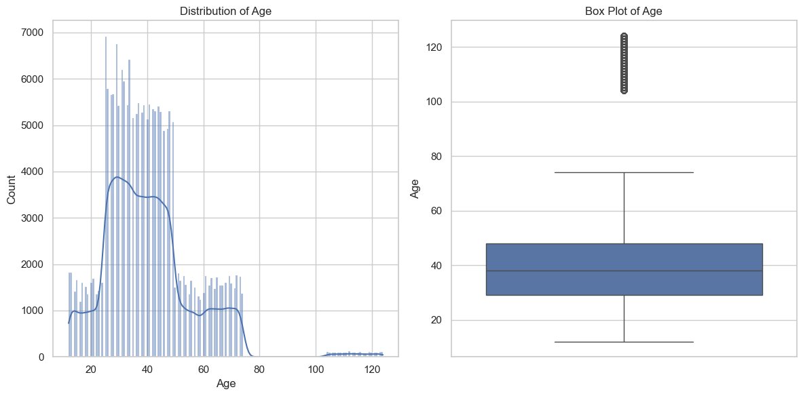

# Churn Prediction
---

**Churn Prediction**: It is the prediction of probability of customer likeliness of not using the product or taking the service in future. It’s significant to reduce Customer Aquisition Cost (CAG) for a service provider. 

> ### Generally: 

**Logic**:  
For example, if we want to predict the customer churn in the next 3 months. In this case the data available till cutoff date will be taken and divided into 2 sections such that last 3 months will be observation period. Customer available in this data will be marked as not churn (0) and rest of the customers available in data before 3 months will be marked as churned (1).  

***Let A***: Before 3 months table 

***B***: Later 3 months table 
Training Data: In training data, we will have all the columns of a customer data table from the previous 3 months and create a new feature called Churn with values “0” for “not churn” and “1” for “churn”. 

- Customer ID available in table B will get churn value as 0 in table A and 1 if not available. 

- Model is trained on data table A , where churn column is the target column 

> ### Challenge here:
As here we don’t have any existing data to create churn feature. We will be creating a churn column on the basis of new features created (CLTV & RFM) 


## Steps :  

> ## I. `Synthetic data generation` 

- ### Useful packages I tried :             

    1.Faker 

    2.Scikit-learn 

    3.PyOD 

    4.ctGAN 

    5.Mimesis   
```python
from mimesis import Address, Finance, Datetime, Person 
```
- ### Columns required: 

    | Demography | Channel Valid | Transaction |
    |---------------|---------------|------------|
    | Customer ID | Email Valid |Transaction Date |
    | Age* |SMS|Purchase |
    | City |Whatsapp |CLTV*|
    |Country|Push notification |RFM* |
    |Gender |-----------|Product Category|

- ### Columns created at first are : 

    ```python
    Index(['CustomerID', 'Gender', 'Date_of_Birth', 'Email Valid', 'SMS Valid', 'WhatsApp Valid', 'Push Notification', 'City', 'Country', 'Product Category', 'Transaction Date', 'Purchase'], dtype='object') 
    ```
    - a customer here is repeated random times 

> ## II. `Adding Noise` 

- ### Ways used to add noise : 

    - Adding random none 
    - Creating anomalies in  the numeric data columns 

> ## III. `Data Profiling`         

- Finding for null value columns 
- Knowing the datatypes and valuecount (frequency) 
- Finding Anomalies in data 

> ## IV. `Data Preprocessing` 

- Removing data anomalies  
- Missing value imputation 

    - **Using**

        - *Simple Imputer* 
            - Gender (constant)
            - Age (mean)
            - Channel valid (mode)
            - Country (mode)
            - City (mode)
            - Transaction date (fixed value- curdate)

        - *KNN*
            - Age (had correlation with Purchase) 
        - *Remove*
            - Any column where Purchase or CutomerID is NULL 
<!-- - Encoding of categorical and numerical data  -->

> ## V. `EDA (Exploratory Data Analysis) `

- ### Using
    ```python 
        import Pandas, Matplotlib, Seaborn, Ydata_profiling
    ```

- *****Finding correlation between columns by plotting graphs***** 

> ## VI. `Feature Engineering` 

- ### Feature Creation
    -  
        |Age|Frequency|Total Product|CLTV|RFM|
        |---|---|---|---|----|
        |-|-|-|-|-|
        ||||||

    -   
        
    -  _____
    
        - <span style="color:yellow">Note:</span> <br>
         Age is created such that most of the cutomers lies betweeb 20 to 55 to resemble the real data. Moreover Age and Purchase (transaction amount) also has correlation that people near to the age of 45 tend to spend more.
         
        - <u style="color:wheat">Frequency:</u> number of non-duplicate rows corresponding to a cutomer ID
        - <u style="color:wheat">Monetary:</u> Sum of number of products correspods to a customer ID

    
        - CLTV (Customer Lifetime Value)
            ```python
            df_new['CLTV'] = ((df_new['TotalProductSum'] * df_new['TotalPurchase']) / (df_new['Frequency'] ** 2)).astype(int)
            # Here totalProductionSum refers to sum of amount spent by a user, 
            # Similarly TotalPurchase is sum of numbers of products he has bought
            ```
    

        - RFM (Recency, Frequency and Monetary value)
            ```python
            rfm_data['RFM_Score'] = (rfm_data['R'] + rfm_data['F'] + rfm_data['M'])/3

            # Here R (Recency), F(Frequency), M(Monetary)

            ```
        - <h3 style="color:yellow">Churn :</h3>
            Adding a 'Churn' column to the input DataFrame based on various conditions. <br>
            This function calculates the 'Churn' status for each customer based on the following rules:
            - ---
        1. If the last transaction date is more than 1.5 months ago, set 'Churn' to 0.
        2. If RFM_Score < 0.1 and Frequency > 1, set 'Churn' to 0.
        3. If CLTV < 1500, set 'Churn' to 0.
        4. If age > 50 and the last transaction date is more than 2 months ago, set 'Churn' to 0.
        5. If age > 60 and Frequency < 5, set 'Churn' to 0.
        6. If M score < 0.2, set 'Churn' to 0.
            - ---
- ### Feature Scaling 
    - 
        ```python
        # Scaling RFM values between 0 and 1
        def min_max_scale(x):
            return (x - x.min()) / (x.max() - x.min())
        ```
    - Encoding of categorical and numerical data 

        - ---
        Restructure the input DataFrame by applying one-hot encoding to categorical features
        and min-max normalization to numerical columns.
        
        This function performs the following operations:
        1. One-hot encodes the specified categorical features: 
        <span style="color:yellow">'Notification_Valid', 'Gender', 'City', 'Country', 'SMS_Valid', 'WhatsApp_Valid', 'Email_Valid'. </span>
        2. Applies min-max normalization to the specified numerical columns: 
        <span style="color:yellow">'Purchase', 'Age', 'Frequency', 'Total_Product', 'CLTV'. </span>
        - ---

- ### Feature Selection 
    -  
        ```python
        # Define features and target
        # insignificant columns are dropped and not considered for training the model
        X = df_unique.drop(columns=['CustomerID', 'Transaction_Date', 'Date_of_Birth', 'Product_Category', 'Churn'])
        y = df_unique['Churn']
        ```
    


> ### VII. `Model Training`
- ### Models Used and why ?
    - i ) ***Linear Regression***
        - When predicting customer churn, classification algorithms are typically used since churn prediction is a binary classification problem.
        - It provides probability estimates which is done here while predicting customer churn
    
    <!-- - ii )
    - iii ) -->

> ### VIII. `Making Prediction`

> ### IX. `Accuracy calculations`
 